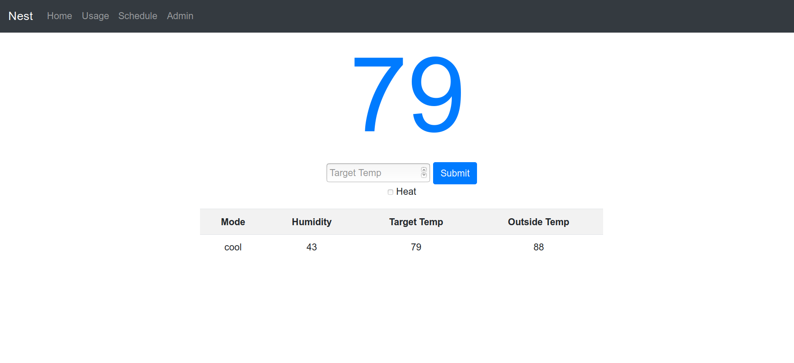

# Nest Interface

A _**very simple**_ web interface for your Nest Thermostat. 

Powered by [nest-api](https://github.com/gboudreau/nest-api)

# Prerequisites 

- A webserver of your choice (Apache, Nginx, etc.)

- PHP

# Usage

Before you can use this web interface you will need to create a `credentials.php` file with the following information filled out:


```
<?php
    $username = 'NEST USERNAME';
    $password = 'NEST PASSWORD';
    $zipcode = 'YOUR ZIPCODE'
?>
```

**Note: this does not work with 2FA. You will need to disable if you want to utilize this API.**

** If you are using a Nest account to login and experience a 406 error or blank page, you will need to change two values in `nest.class.php` as stated [here](https://github.com/gboudreau/nest-api/issues/98#issuecomment-553724561). ** 




